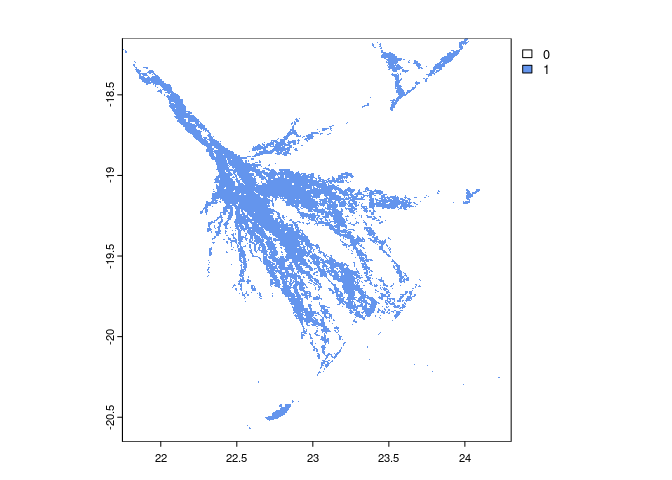

<!-- README.md is generated from README.Rmd. Please edit that file -->

# floodmapr 

`floodmapr` is an R-package that allows you to download and classify
[MODIS MCD43A4](https://lpdaac.usgs.gov/products/mcd43a4v006/) satellite
imagery into binary maps of dryland and water cover. To be able to
download data, you need to have an
[EarthData](https://earthdata.nasa.gov/) account (free). The
classification algorithm is based on the publication of Wolski et al.,
2017 and currently only applicable for the extent of the Okavango Delta
(see [Okavango Research
Institute](http://www.okavangodata.ub.bw/ori/monitoring/flood_maps/#)).

## Installation

You can install the development version of floodmapr from
[GitHub](https://github.com/) with:

``` r
# install.packages("devtools")
devtools::install_github("DavidDHofmann/floodmapr")
```

## Workflow

The `floodmapr` package follows a three step process using the
functions, `modis_download()`, `modis_load()`, and `modis_classify()`.

1.  `modis_download()` Download MCD43A4 satellite imagery for desired
    dates for the extent of the Okavango Delta. The function
    automatically downloads, extracts, stitches and reprojects (EPSG
    4326) corresponding modis tiles and stores them into a multiband
    raster. The output files are named according to the input date
    (e.g. *2020-01-01.tif*). Note: while only band 7 will be used in
    the later process, bands 1-7 are stored for completeness.

2.  `modis_load()` Once you have downloaded the satellite imagery, load
    it into R using `modis_load()`. This will only load band 7 into your
    current R session.

3.  `modis_classify()` Classify the satellite image into a binary map of
    water (valued 1) and dryland (valued 0). You can then use the
    resulting raster and e.g. `plot()` it.

In addition to the above described main functions there are some
additional helper functions that allow you to do some preliminary
analysis on MODIS MCD43A4 band 7.

  - `modis_bimodal()` allows you to check if modis band 7 is bimodal.
    This is required to be able to classify the image. Bimodality can
    fail during some months of the year, when surface reflectance of
    water and dryland become more alike.

  - `modis_specs()` plots the densities of water- and
    dryland-reflectance values. Again, this can be used to visualize how
    bimodal the distribution of these values is.

  - `modis_precentiles()` percentile values of water- and
    dryland-reflecatances.

Finally, there is a function called `modis_watermask()`. This function
can be used to create a dynamic watermask that can ultimately be fed
into `modis_classify()`. In contrast to the static watermask used by
`floodmapr` in the background, the dynamic watermask uses previously
classified foodmaps to determine areas that were frequently flooded in
the past. This way, the algorithm is able to learn about potential
long-term changes in the system.

## Example

Here is a complete example of the above outlined workflow

``` r
library(floodmapr)

# Download modis data (you need to provide your own username and password)
downloaded <- modis_download(
    dates     = c("2017-08-21", "2017-08-22")
  , outdir    = tempdir()
  , tmpdir    = tempdir()
  , username  = username
  , password  = password
  , overwrite = F
)
#> Downloading tiles: 1 out of 4 
#> Downloading: 27 B     Downloading: 27 B     Downloading: 27 B     Downloading: 320 B     Downloading: 320 B     Downloading: 320 B       |                                                                              |                                                                      |   0%  |                                                                              |                                                                      |   1%  |                                                                              |=                                                                     |   1%  |                                                                              |=                                                                     |   2%  |                                                                              |==                                                                    |   2%  |                                                                              |==                                                                    |   3%  |                                                                              |==                                                                    |   4%  |                                                                              |===                                                                   |   4%  |                                                                              |===                                                                   |   5%  |                                                                              |====                                                                  |   5%  |                                                                              |====                                                                  |   6%  |                                                                              |=====                                                                 |   7%  |                                                                              |=====                                                                 |   8%  |                                                                              |======                                                                |   8%  |                                                                              |======                                                                |   9%  |                                                                              |=======                                                               |   9%  |                                                                              |=======                                                               |  10%  |                                                                              |=======                                                               |  11%  |                                                                              |========                                                              |  11%  |                                                                              |========                                                              |  12%  |                                                                              |=========                                                             |  12%  |                                                                              |=========                                                             |  13%  |                                                                              |==========                                                            |  14%  |                                                                              |==========                                                            |  15%  |                                                                              |===========                                                           |  15%  |                                                                              |===========                                                           |  16%  |                                                                              |============                                                          |  17%  |                                                                              |============                                                          |  18%  |                                                                              |=============                                                         |  18%  |                                                                              |=============                                                         |  19%  |                                                                              |==============                                                        |  19%  |                                                                              |==============                                                        |  20%  |                                                                              |==============                                                        |  21%  |                                                                              |===============                                                       |  21%  |                                                                              |===============                                                       |  22%  |                                                                              |================                                                      |  22%  |                                                                              |================                                                      |  23%  |                                                                              |================                                                      |  24%  |                                                                              |=================                                                     |  24%  |                                                                              |=================                                                     |  25%  |                                                                              |==================                                                    |  25%  |                                                                              |==================                                                    |  26%  |                                                                              |===================                                                   |  27%  |                                                                              |===================                                                   |  28%  |                                                                              |====================                                                  |  28%  |                                                                              |====================                                                  |  29%  |                                                                              |=====================                                                 |  29%  |                                                                              |=====================                                                 |  30%  |                                                                              |=====================                                                 |  31%  |                                                                              |======================                                                |  31%  |                                                                              |======================                                                |  32%  |                                                                              |=======================                                               |  32%  |                                                                              |=======================                                               |  33%  |                                                                              |=======================                                               |  34%  |                                                                              |========================                                              |  34%  |                                                                              |========================                                              |  35%  |                                                                              |=========================                                             |  35%  |                                                                              |=========================                                             |  36%  |                                                                              |==========================                                            |  36%  |                                                                              |==========================                                            |  37%  |                                                                              |==========================                                            |  38%  |                                                                              |===========================                                           |  38%  |                                                                              |===========================                                           |  39%  |                                                                              |============================                                          |  39%  |                                                                              |============================                                          |  40%  |                                                                              |============================                                          |  41%  |                                                                              |=============================                                         |  41%  |                                                                              |=============================                                         |  42%  |                                                                              |==============================                                        |  42%  |                                                                              |==============================                                        |  43%  |                                                                              |==============================                                        |  44%  |                                                                              |===============================                                       |  44%  |                                                                              |===============================                                       |  45%  |                                                                              |================================                                      |  45%  |                                                                              |================================                                      |  46%  |                                                                              |=================================                                     |  46%  |                                                                              |=================================                                     |  47%  |                                                                              |=================================                                     |  48%  |                                                                              |==================================                                    |  48%  |                                                                              |==================================                                    |  49%  |                                                                              |===================================                                   |  49%  |                                                                              |===================================                                   |  50%  |                                                                              |===================================                                   |  51%  |                                                                              |====================================                                  |  51%  |                                                                              |====================================                                  |  52%  |                                                                              |=====================================                                 |  52%  |                                                                              |=====================================                                 |  53%  |                                                                              |=====================================                                 |  54%  |                                                                              |======================================                                |  54%  |                                                                              |======================================                                |  55%  |                                                                              |=======================================                               |  55%  |                                                                              |=======================================                               |  56%  |                                                                              |========================================                              |  56%  |                                                                              |========================================                              |  57%  |                                                                              |========================================                              |  58%  |                                                                              |=========================================                             |  58%  |                                                                              |=========================================                             |  59%  |                                                                              |==========================================                            |  59%  |                                                                              |==========================================                            |  60%  |                                                                              |==========================================                            |  61%  |                                                                              |===========================================                           |  61%  |                                                                              |===========================================                           |  62%  |                                                                              |============================================                          |  62%  |                                                                              |============================================                          |  63%  |                                                                              |=============================================                         |  64%  |                                                                              |=============================================                         |  65%  |                                                                              |==============================================                        |  65%  |                                                                              |==============================================                        |  66%  |                                                                              |===============================================                       |  67%  |                                                                              |===============================================                       |  68%  |                                                                              |================================================                      |  68%  |                                                                              |================================================                      |  69%  |                                                                              |=================================================                     |  69%  |                                                                              |=================================================                     |  70%  |                                                                              |=================================================                     |  71%  |                                                                              |==================================================                    |  71%  |                                                                              |==================================================                    |  72%  |                                                                              |===================================================                   |  72%  |                                                                              |===================================================                   |  73%  |                                                                              |===================================================                   |  74%  |                                                                              |====================================================                  |  74%  |                                                                              |====================================================                  |  75%  |                                                                              |=====================================================                 |  75%  |                                                                              |=====================================================                 |  76%  |                                                                              |======================================================                |  76%  |                                                                              |======================================================                |  77%  |                                                                              |======================================================                |  78%  |                                                                              |=======================================================               |  78%  |                                                                              |=======================================================               |  79%  |                                                                              |========================================================              |  79%  |                                                                              |========================================================              |  80%  |                                                                              |========================================================              |  81%  |                                                                              |=========================================================             |  81%  |                                                                              |=========================================================             |  82%  |                                                                              |==========================================================            |  82%  |                                                                              |==========================================================            |  83%  |                                                                              |==========================================================            |  84%  |                                                                              |===========================================================           |  84%  |                                                                              |===========================================================           |  85%  |                                                                              |============================================================          |  85%  |                                                                              |============================================================          |  86%  |                                                                              |=============================================================         |  86%  |                                                                              |=============================================================         |  87%  |                                                                              |=============================================================         |  88%  |                                                                              |==============================================================        |  88%  |                                                                              |==============================================================        |  89%  |                                                                              |===============================================================       |  89%  |                                                                              |===============================================================       |  90%  |                                                                              |===============================================================       |  91%  |                                                                              |================================================================      |  91%  |                                                                              |================================================================      |  92%  |                                                                              |=================================================================     |  92%  |                                                                              |=================================================================     |  93%  |                                                                              |=================================================================     |  94%  |                                                                              |==================================================================    |  94%  |                                                                              |==================================================================    |  95%  |                                                                              |===================================================================   |  95%  |                                                                              |===================================================================   |  96%  |                                                                              |====================================================================  |  96%  |                                                                              |====================================================================  |  97%  |                                                                              |====================================================================  |  98%  |                                                                              |===================================================================== |  98%  |                                                                              |===================================================================== |  99%  |                                                                              |======================================================================|  99%  |                                                                              |======================================================================| 100%
#> Downloading tiles: 2 out of 4 
#>   |                                                                              |                                                                      |   0%  |                                                                              |                                                                      |   1%  |                                                                              |=                                                                     |   1%  |                                                                              |=                                                                     |   2%  |                                                                              |==                                                                    |   2%  |                                                                              |==                                                                    |   3%  |                                                                              |===                                                                   |   4%  |                                                                              |===                                                                   |   5%  |                                                                              |====                                                                  |   5%  |                                                                              |====                                                                  |   6%  |                                                                              |=====                                                                 |   7%  |                                                                              |=====                                                                 |   8%  |                                                                              |======                                                                |   8%  |                                                                              |======                                                                |   9%  |                                                                              |=======                                                               |   9%  |                                                                              |=======                                                               |  10%  |                                                                              |=======                                                               |  11%  |                                                                              |========                                                              |  11%  |                                                                              |========                                                              |  12%  |                                                                              |=========                                                             |  12%  |                                                                              |=========                                                             |  13%  |                                                                              |==========                                                            |  14%  |                                                                              |==========                                                            |  15%  |                                                                              |===========                                                           |  15%  |                                                                              |===========                                                           |  16%  |                                                                              |============                                                          |  16%  |                                                                              |============                                                          |  17%  |                                                                              |============                                                          |  18%  |                                                                              |=============                                                         |  18%  |                                                                              |=============                                                         |  19%  |                                                                              |==============                                                        |  19%  |                                                                              |==============                                                        |  20%  |                                                                              |==============                                                        |  21%  |                                                                              |===============                                                       |  21%  |                                                                              |===============                                                       |  22%  |                                                                              |================                                                      |  22%  |                                                                              |================                                                      |  23%  |                                                                              |=================                                                     |  24%  |                                                                              |=================                                                     |  25%  |                                                                              |==================                                                    |  25%  |                                                                              |==================                                                    |  26%  |                                                                              |===================                                                   |  26%  |                                                                              |===================                                                   |  27%  |                                                                              |===================                                                   |  28%  |                                                                              |====================                                                  |  28%  |                                                                              |====================                                                  |  29%  |                                                                              |=====================                                                 |  29%  |                                                                              |=====================                                                 |  30%  |                                                                              |=====================                                                 |  31%  |                                                                              |======================                                                |  31%  |                                                                              |======================                                                |  32%  |                                                                              |=======================                                               |  32%  |                                                                              |=======================                                               |  33%  |                                                                              |========================                                              |  34%  |                                                                              |========================                                              |  35%  |                                                                              |=========================                                             |  35%  |                                                                              |=========================                                             |  36%  |                                                                              |==========================                                            |  36%  |                                                                              |==========================                                            |  37%  |                                                                              |==========================                                            |  38%  |                                                                              |===========================                                           |  38%  |                                                                              |===========================                                           |  39%  |                                                                              |============================                                          |  39%  |                                                                              |============================                                          |  40%  |                                                                              |============================                                          |  41%  |                                                                              |=============================                                         |  41%  |                                                                              |=============================                                         |  42%  |                                                                              |==============================                                        |  42%  |                                                                              |==============================                                        |  43%  |                                                                              |===============================                                       |  44%  |                                                                              |===============================                                       |  45%  |                                                                              |================================                                      |  45%  |                                                                              |================================                                      |  46%  |                                                                              |=================================                                     |  46%  |                                                                              |=================================                                     |  47%  |                                                                              |=================================                                     |  48%  |                                                                              |==================================                                    |  48%  |                                                                              |==================================                                    |  49%  |                                                                              |===================================                                   |  49%  |                                                                              |===================================                                   |  50%  |                                                                              |===================================                                   |  51%  |                                                                              |====================================                                  |  51%  |                                                                              |====================================                                  |  52%  |                                                                              |=====================================                                 |  52%  |                                                                              |=====================================                                 |  53%  |                                                                              |======================================                                |  54%  |                                                                              |======================================                                |  55%  |                                                                              |=======================================                               |  55%  |                                                                              |=======================================                               |  56%  |                                                                              |========================================                              |  56%  |                                                                              |========================================                              |  57%  |                                                                              |========================================                              |  58%  |                                                                              |=========================================                             |  58%  |                                                                              |=========================================                             |  59%  |                                                                              |==========================================                            |  59%  |                                                                              |==========================================                            |  60%  |                                                                              |==========================================                            |  61%  |                                                                              |===========================================                           |  61%  |                                                                              |===========================================                           |  62%  |                                                                              |============================================                          |  62%  |                                                                              |============================================                          |  63%  |                                                                              |============================================                          |  64%  |                                                                              |=============================================                         |  64%  |                                                                              |=============================================                         |  65%  |                                                                              |==============================================                        |  65%  |                                                                              |==============================================                        |  66%  |                                                                              |===============================================                       |  67%  |                                                                              |===============================================                       |  68%  |                                                                              |================================================                      |  68%  |                                                                              |================================================                      |  69%  |                                                                              |=================================================                     |  69%  |                                                                              |=================================================                     |  70%  |                                                                              |=================================================                     |  71%  |                                                                              |==================================================                    |  71%  |                                                                              |==================================================                    |  72%  |                                                                              |===================================================                   |  72%  |                                                                              |===================================================                   |  73%  |                                                                              |===================================================                   |  74%  |                                                                              |====================================================                  |  74%  |                                                                              |====================================================                  |  75%  |                                                                              |=====================================================                 |  75%  |                                                                              |=====================================================                 |  76%  |                                                                              |======================================================                |  76%  |                                                                              |======================================================                |  77%  |                                                                              |======================================================                |  78%  |                                                                              |=======================================================               |  78%  |                                                                              |=======================================================               |  79%  |                                                                              |========================================================              |  79%  |                                                                              |========================================================              |  80%  |                                                                              |========================================================              |  81%  |                                                                              |=========================================================             |  81%  |                                                                              |=========================================================             |  82%  |                                                                              |==========================================================            |  82%  |                                                                              |==========================================================            |  83%  |                                                                              |==========================================================            |  84%  |                                                                              |===========================================================           |  84%  |                                                                              |===========================================================           |  85%  |                                                                              |============================================================          |  85%  |                                                                              |============================================================          |  86%  |                                                                              |=============================================================         |  87%  |                                                                              |=============================================================         |  88%  |                                                                              |==============================================================        |  88%  |                                                                              |==============================================================        |  89%  |                                                                              |===============================================================       |  89%  |                                                                              |===============================================================       |  90%  |                                                                              |===============================================================       |  91%  |                                                                              |================================================================      |  91%  |                                                                              |================================================================      |  92%  |                                                                              |=================================================================     |  92%  |                                                                              |=================================================================     |  93%  |                                                                              |=================================================================     |  94%  |                                                                              |==================================================================    |  94%  |                                                                              |==================================================================    |  95%  |                                                                              |===================================================================   |  95%  |                                                                              |===================================================================   |  96%  |                                                                              |====================================================================  |  96%  |                                                                              |====================================================================  |  97%  |                                                                              |====================================================================  |  98%  |                                                                              |===================================================================== |  98%  |                                                                              |===================================================================== |  99%  |                                                                              |======================================================================|  99%  |                                                                              |======================================================================| 100%
#> Downloading tiles: 3 out of 4 
#>   |                                                                              |                                                                      |   0%  |                                                                              |                                                                      |   1%  |                                                                              |=                                                                     |   1%  |                                                                              |=                                                                     |   2%  |                                                                              |==                                                                    |   2%  |                                                                              |==                                                                    |   3%  |                                                                              |==                                                                    |   4%  |                                                                              |===                                                                   |   4%  |                                                                              |===                                                                   |   5%  |                                                                              |====                                                                  |   5%  |                                                                              |====                                                                  |   6%  |                                                                              |=====                                                                 |   7%  |                                                                              |=====                                                                 |   8%  |                                                                              |======                                                                |   8%  |                                                                              |======                                                                |   9%  |                                                                              |=======                                                               |   9%  |                                                                              |=======                                                               |  10%  |                                                                              |=======                                                               |  11%  |                                                                              |========                                                              |  11%  |                                                                              |========                                                              |  12%  |                                                                              |=========                                                             |  12%  |                                                                              |=========                                                             |  13%  |                                                                              |==========                                                            |  14%  |                                                                              |==========                                                            |  15%  |                                                                              |===========                                                           |  15%  |                                                                              |===========                                                           |  16%  |                                                                              |============                                                          |  16%  |                                                                              |============                                                          |  17%  |                                                                              |============                                                          |  18%  |                                                                              |=============                                                         |  18%  |                                                                              |=============                                                         |  19%  |                                                                              |==============                                                        |  19%  |                                                                              |==============                                                        |  20%  |                                                                              |==============                                                        |  21%  |                                                                              |===============                                                       |  21%  |                                                                              |===============                                                       |  22%  |                                                                              |================                                                      |  22%  |                                                                              |================                                                      |  23%  |                                                                              |================                                                      |  24%  |                                                                              |=================                                                     |  24%  |                                                                              |=================                                                     |  25%  |                                                                              |==================                                                    |  25%  |                                                                              |==================                                                    |  26%  |                                                                              |===================                                                   |  27%  |                                                                              |===================                                                   |  28%  |                                                                              |====================                                                  |  28%  |                                                                              |====================                                                  |  29%  |                                                                              |=====================                                                 |  29%  |                                                                              |=====================                                                 |  30%  |                                                                              |=====================                                                 |  31%  |                                                                              |======================                                                |  31%  |                                                                              |======================                                                |  32%  |                                                                              |=======================                                               |  32%  |                                                                              |=======================                                               |  33%  |                                                                              |=======================                                               |  34%  |                                                                              |========================                                              |  34%  |                                                                              |========================                                              |  35%  |                                                                              |=========================                                             |  35%  |                                                                              |=========================                                             |  36%  |                                                                              |==========================                                            |  36%  |                                                                              |==========================                                            |  37%  |                                                                              |==========================                                            |  38%  |                                                                              |===========================                                           |  38%  |                                                                              |===========================                                           |  39%  |                                                                              |============================                                          |  39%  |                                                                              |============================                                          |  40%  |                                                                              |============================                                          |  41%  |                                                                              |=============================                                         |  41%  |                                                                              |=============================                                         |  42%  |                                                                              |==============================                                        |  42%  |                                                                              |==============================                                        |  43%  |                                                                              |===============================                                       |  44%  |                                                                              |===============================                                       |  45%  |                                                                              |================================                                      |  45%  |                                                                              |================================                                      |  46%  |                                                                              |=================================                                     |  46%  |                                                                              |=================================                                     |  47%  |                                                                              |=================================                                     |  48%  |                                                                              |==================================                                    |  48%  |                                                                              |==================================                                    |  49%  |                                                                              |===================================                                   |  49%  |                                                                              |===================================                                   |  50%  |                                                                              |===================================                                   |  51%  |                                                                              |====================================                                  |  51%  |                                                                              |====================================                                  |  52%  |                                                                              |=====================================                                 |  52%  |                                                                              |=====================================                                 |  53%  |                                                                              |=====================================                                 |  54%  |                                                                              |======================================                                |  54%  |                                                                              |======================================                                |  55%  |                                                                              |=======================================                               |  55%  |                                                                              |=======================================                               |  56%  |                                                                              |========================================                              |  57%  |                                                                              |========================================                              |  58%  |                                                                              |=========================================                             |  58%  |                                                                              |=========================================                             |  59%  |                                                                              |==========================================                            |  59%  |                                                                              |==========================================                            |  60%  |                                                                              |==========================================                            |  61%  |                                                                              |===========================================                           |  61%  |                                                                              |===========================================                           |  62%  |                                                                              |============================================                          |  62%  |                                                                              |============================================                          |  63%  |                                                                              |============================================                          |  64%  |                                                                              |=============================================                         |  64%  |                                                                              |=============================================                         |  65%  |                                                                              |==============================================                        |  65%  |                                                                              |==============================================                        |  66%  |                                                                              |===============================================                       |  66%  |                                                                              |===============================================                       |  67%  |                                                                              |===============================================                       |  68%  |                                                                              |================================================                      |  68%  |                                                                              |================================================                      |  69%  |                                                                              |=================================================                     |  69%  |                                                                              |=================================================                     |  70%  |                                                                              |=================================================                     |  71%  |                                                                              |==================================================                    |  71%  |                                                                              |==================================================                    |  72%  |                                                                              |===================================================                   |  72%  |                                                                              |===================================================                   |  73%  |                                                                              |====================================================                  |  74%  |                                                                              |====================================================                  |  75%  |                                                                              |=====================================================                 |  75%  |                                                                              |=====================================================                 |  76%  |                                                                              |======================================================                |  77%  |                                                                              |======================================================                |  78%  |                                                                              |=======================================================               |  78%  |                                                                              |=======================================================               |  79%  |                                                                              |========================================================              |  79%  |                                                                              |========================================================              |  80%  |                                                                              |========================================================              |  81%  |                                                                              |=========================================================             |  81%  |                                                                              |=========================================================             |  82%  |                                                                              |==========================================================            |  82%  |                                                                              |==========================================================            |  83%  |                                                                              |==========================================================            |  84%  |                                                                              |===========================================================           |  84%  |                                                                              |===========================================================           |  85%  |                                                                              |============================================================          |  85%  |                                                                              |============================================================          |  86%  |                                                                              |=============================================================         |  86%  |                                                                              |=============================================================         |  87%  |                                                                              |=============================================================         |  88%  |                                                                              |==============================================================        |  88%  |                                                                              |==============================================================        |  89%  |                                                                              |===============================================================       |  90%  |                                                                              |===============================================================       |  91%  |                                                                              |================================================================      |  91%  |                                                                              |================================================================      |  92%  |                                                                              |=================================================================     |  92%  |                                                                              |=================================================================     |  93%  |                                                                              |==================================================================    |  94%  |                                                                              |==================================================================    |  95%  |                                                                              |===================================================================   |  95%  |                                                                              |===================================================================   |  96%  |                                                                              |====================================================================  |  96%  |                                                                              |====================================================================  |  97%  |                                                                              |====================================================================  |  98%  |                                                                              |===================================================================== |  98%  |                                                                              |===================================================================== |  99%  |                                                                              |======================================================================|  99%  |                                                                              |======================================================================| 100%
#> Downloading tiles: 4 out of 4 
#>   |                                                                              |                                                                      |   0%  |                                                                              |                                                                      |   1%  |                                                                              |=                                                                     |   1%  |                                                                              |=                                                                     |   2%  |                                                                              |==                                                                    |   2%  |                                                                              |==                                                                    |   3%  |                                                                              |==                                                                    |   4%  |                                                                              |===                                                                   |   4%  |                                                                              |===                                                                   |   5%  |                                                                              |====                                                                  |   5%  |                                                                              |====                                                                  |   6%  |                                                                              |=====                                                                 |   6%  |                                                                              |=====                                                                 |   7%  |                                                                              |======                                                                |   9%  |                                                                              |=======                                                               |   9%  |                                                                              |=======                                                               |  10%  |                                                                              |=======                                                               |  11%  |                                                                              |========                                                              |  11%  |                                                                              |========                                                              |  12%  |                                                                              |=========                                                             |  12%  |                                                                              |=========                                                             |  13%  |                                                                              |=========                                                             |  14%  |                                                                              |==========                                                            |  14%  |                                                                              |==========                                                            |  15%  |                                                                              |===========                                                           |  15%  |                                                                              |===========                                                           |  16%  |                                                                              |============                                                          |  16%  |                                                                              |============                                                          |  17%  |                                                                              |=============                                                         |  19%  |                                                                              |==============                                                        |  19%  |                                                                              |==============                                                        |  20%  |                                                                              |==============                                                        |  21%  |                                                                              |===============                                                       |  21%  |                                                                              |===============                                                       |  22%  |                                                                              |================                                                      |  22%  |                                                                              |================                                                      |  23%  |                                                                              |=================                                                     |  24%  |                                                                              |=================                                                     |  25%  |                                                                              |==================                                                    |  25%  |                                                                              |==================                                                    |  26%  |                                                                              |===================                                                   |  26%  |                                                                              |===================                                                   |  27%  |                                                                              |===================                                                   |  28%  |                                                                              |====================                                                  |  28%  |                                                                              |====================                                                  |  29%  |                                                                              |=====================                                                 |  29%  |                                                                              |=====================                                                 |  30%  |                                                                              |=====================                                                 |  31%  |                                                                              |======================                                                |  31%  |                                                                              |======================                                                |  32%  |                                                                              |=======================                                               |  32%  |                                                                              |=======================                                               |  33%  |                                                                              |=======================                                               |  34%  |                                                                              |========================                                              |  34%  |                                                                              |========================                                              |  35%  |                                                                              |=========================                                             |  35%  |                                                                              |=========================                                             |  36%  |                                                                              |==========================                                            |  36%  |                                                                              |==========================                                            |  37%  |                                                                              |==========================                                            |  38%  |                                                                              |===========================                                           |  38%  |                                                                              |===========================                                           |  39%  |                                                                              |============================                                          |  39%  |                                                                              |============================                                          |  40%  |                                                                              |============================                                          |  41%  |                                                                              |=============================                                         |  41%  |                                                                              |=============================                                         |  42%  |                                                                              |==============================                                        |  42%  |                                                                              |==============================                                        |  43%  |                                                                              |==============================                                        |  44%  |                                                                              |===============================                                       |  44%  |                                                                              |===============================                                       |  45%  |                                                                              |================================                                      |  45%  |                                                                              |================================                                      |  46%  |                                                                              |=================================                                     |  47%  |                                                                              |=================================                                     |  48%  |                                                                              |==================================                                    |  48%  |                                                                              |==================================                                    |  49%  |                                                                              |===================================                                   |  49%  |                                                                              |===================================                                   |  50%  |                                                                              |===================================                                   |  51%  |                                                                              |====================================                                  |  51%  |                                                                              |====================================                                  |  52%  |                                                                              |=====================================                                 |  52%  |                                                                              |=====================================                                 |  53%  |                                                                              |======================================                                |  54%  |                                                                              |======================================                                |  55%  |                                                                              |=======================================                               |  55%  |                                                                              |=======================================                               |  56%  |                                                                              |========================================                              |  57%  |                                                                              |========================================                              |  58%  |                                                                              |=========================================                             |  58%  |                                                                              |=========================================                             |  59%  |                                                                              |==========================================                            |  60%  |                                                                              |==========================================                            |  61%  |                                                                              |===========================================                           |  61%  |                                                                              |===========================================                           |  62%  |                                                                              |============================================                          |  62%  |                                                                              |============================================                          |  63%  |                                                                              |=============================================                         |  64%  |                                                                              |=============================================                         |  65%  |                                                                              |==============================================                        |  65%  |                                                                              |==============================================                        |  66%  |                                                                              |===============================================                       |  67%  |                                                                              |===============================================                       |  68%  |                                                                              |================================================                      |  68%  |                                                                              |================================================                      |  69%  |                                                                              |=================================================                     |  69%  |                                                                              |=================================================                     |  70%  |                                                                              |=================================================                     |  71%  |                                                                              |==================================================                    |  71%  |                                                                              |==================================================                    |  72%  |                                                                              |===================================================                   |  72%  |                                                                              |===================================================                   |  73%  |                                                                              |===================================================                   |  74%  |                                                                              |====================================================                  |  74%  |                                                                              |====================================================                  |  75%  |                                                                              |=====================================================                 |  75%  |                                                                              |=====================================================                 |  76%  |                                                                              |======================================================                |  77%  |                                                                              |======================================================                |  78%  |                                                                              |=======================================================               |  78%  |                                                                              |=======================================================               |  79%  |                                                                              |========================================================              |  79%  |                                                                              |========================================================              |  80%  |                                                                              |========================================================              |  81%  |                                                                              |=========================================================             |  81%  |                                                                              |=========================================================             |  82%  |                                                                              |==========================================================            |  82%  |                                                                              |==========================================================            |  83%  |                                                                              |==========================================================            |  84%  |                                                                              |===========================================================           |  84%  |                                                                              |===========================================================           |  85%  |                                                                              |============================================================          |  85%  |                                                                              |============================================================          |  86%  |                                                                              |=============================================================         |  86%  |                                                                              |=============================================================         |  87%  |                                                                              |=============================================================         |  88%  |                                                                              |==============================================================        |  88%  |                                                                              |==============================================================        |  89%  |                                                                              |===============================================================       |  89%  |                                                                              |===============================================================       |  90%  |                                                                              |===============================================================       |  91%  |                                                                              |================================================================      |  91%  |                                                                              |================================================================      |  92%  |                                                                              |=================================================================     |  92%  |                                                                              |=================================================================     |  93%  |                                                                              |==================================================================    |  94%  |                                                                              |==================================================================    |  95%  |                                                                              |===================================================================   |  95%  |                                                                              |===================================================================   |  96%  |                                                                              |====================================================================  |  96%  |                                                                              |====================================================================  |  97%  |                                                                              |====================================================================  |  98%  |                                                                              |===================================================================== |  98%  |                                                                              |===================================================================== |  99%  |                                                                              |======================================================================|  99%  |                                                                              |======================================================================| 100%
#> All tiles downloaded. Extracting tiffs from hdf files now...
#> All hdf files extracted. Stitching tiles now...
#> All tiles stitched. Reprojecting and cropping final tiles now...
#> Finished!

# Load data
loaded <- modis_load(downloaded[1])

# Do some checks
modis_specs(loaded)
```


``` r
modis_bimodal(loaded)
#> [1] TRUE
modis_percentiles(loaded)
#>     WaterPercentiles DrylandPercentiles
#> 1%          0.061975           0.185900
#> 99%         0.142550           0.333344

# Classify data
classified <- modis_classify(loaded)

# Visualize classified image (0 = dryland, 1 = water, 2 = clouds)
plot(classified, col = c("white", "cornflowerblue"))
```



## References

*Wolski, Piotr, Mike Murray-Hudson, Kgalalelo Thito, und Lin Cassidy.
„Keeping It Simple: Monitoring Flood Extent in Large Data-Poor
Wetlands Using MODIS SWIR Data“. International Journal of Applied Earth
Observation and Geoinformation 57 (May 2017): 224–34.
<https://doi.org/10.1016/j.jag.2017.01.005>.*
